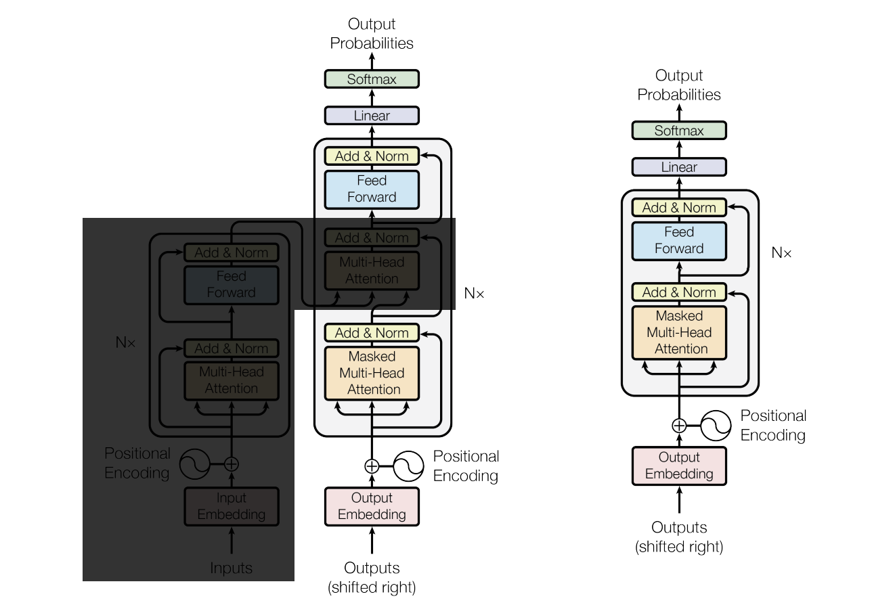

# AustenGPT

## Architecture



This diagram shows the architecture we implement here. On the left is the architecture described in the "Attention is all you need" paper. We will omit the cross-attention block, so our actual architecture is shown by the diagram on the right, with one caveat: the convention now is to apply LayerNorm *before* the attention layer and the FFN layer, instead of after.

> *Diagram from https://www.ericjwang.com/assets/images/gpt_arch.png*

## Transformer Block ([block.py](/austen-gpt/block.py))

The transformer block is everything in the gray box shown in the diagram above. It consists of 4 layers:

1. LayerNorm
2. Multi-head self-attention (causal self-attention)
3. LayerNorm
4. Feed-forward network (FFN): we will use MLP

We also use residual connection and dropout layers.

### Multi-head self-attention

> Implementation: `class CausalSelfAttention`

**Causal** self-attention just means each token can only attend to **previous** tokens. This is what's used in **decoder** models (e.g. GPT), as opposed to **encoder** models, where each token can attend to **all** tokens.

**Attention layer:**

This layer processes query (Q), key (K), and value (V). These vectors allow us to compute the affinity between tokens.

Every token emits these 3 vectors:
- Query: "here's what I'm interested in"
- Key: "here's what I have"
- Value: "if you find me interesting, here's what I will communicate to you"

We can think of `key(input)` and `query(input)` as "mapping each token embedding onto a key/query space." If the dot product of `q` and `k` is large, then the query and key are closely related.

If tokenA's query and tokenB's key are closely related, then we will pass tokenB's value to tokenA. We can think of this as, we use query and key to compute a "weight," then use the "weight" to determine how much of the value to pass between tokens.

**Projection layer:**

We will use a projection layer to combine the heads' results together. This introduces "mixing" instead of merely concatenating the outputs.

**Dropout:**

Dropout prevents overfitting by randomly omitting some values in the matrices (setting them to 0).

In our CausalSelfAttention block, we introduce dropout twice: once on the "weights" generated by Q and K (this is `attention_dropout`), and another time on the final output (this is `resid_dropout`). The final dropout is called `resid_dropout` because this applied right before residual connections (see where `CausalSelfAttention` is invoked in `Block` class).

### LayerNorm

> Implementation: `class LayerNorm`

LayerNorm normalizes each feature vector to have mean=0 and variance=1. This helps stabilize training and prevent vanishing/exploding gradients, especially in deep networks.

```python
# Without LayerNorm:
Layer 1 output: [0.1, 0.2, 0.15]
Layer 10 output: [100, 200, 150]  # Values explode!

# With LayerNorm (after each layer):
Layer 1 output: [0.1, 0.2, 0.15] → normalized
Layer 10 output: still normalized around 0 with variance 1
```

### Feed-forward network (FFN)

> Implementation: `class MLP`

MLP is the most common implementation of feed-forward network. Our MLP implementation consists of 3 layers:

**Layer 1: linear layer (expansion)**

- Expands dimensions from n_embd to 4 * n_embd: (B, T, n_embd) -> (B, T, 4 * n_embd)
- "cfc" = "causally fully connected" (naming from GPT-2)
- Creates a wider hidden layer for more expressive computation

**Layer 2: GELU activation function**

- GELU = Gaussian Error Linear Unit
- Smoother / performs better than ReLU
- Allows network to learn non-linear patterns

```python
# Without activation (just linear layers):
output = W2 @ (W1 @ x) = (W2 @ W1) @ x  # Just one big linear transform!

# With activation:
output = W2 @ GELU(W1 @ x)  # Now it's non-linear!
```

**Layer 3: linear layer (projection)**

- Projects dimensions back to n_embd: (B, T, 4 * n_embd) -> (B, T, n_embd)
- Returns to original dimension to allow for residual connection

We also apply dropout on the output of the MLP block.

---

## Combining transformer blocks into GPT ([gpt.py](/austen-gpt/gpt.py))

The model is implemented in `class GPT` in [gpt.py](/austen-gpt/gpt.py).

### (1) GPT class constructor

**Transformer components**:

- **Word token embedding (wte)**: maps token IDs to embeddings (`vocab_size` tokens, each mapped to `n_embd` dimensions)
- **Word position embedding (wpe)**: maps token positions to embeddings (`block_size` positions, each mapped to `n_embd` dimensions)
- **Dropout layer**: applied after adding token embeddings and position embeddings
- **Hidden layers**: transformer blocks, each block has attention + FFN (MLP)
- **Final LayerNorm**: applied after all transformer blocks

```python
self.transformer = nn.ModuleDict(dict[str, Module](
    wte = nn.Embedding(config.vocab_size, config.n_embd),
    wpe = nn.Embedding(config.block_size, config.n_embd),
    drop = nn.Dropout(config.dropout),
    h = nn.ModuleList([Block(config) for _ in range(config.n_layer)]),
    ln_f = LayerNorm(config.n_embd, bias=config.bias),
))
```

**Language-modeling head**:

- Maps embeddings (of dimension `n_embd`) to logits (of dimension `vocab_size`) to predict the next token

```python
self.lm_head = nn.Linear(config.n_embd, config.vocab_size, bias=False)
```

**Weight tying**:

- Shares weights between input embedding (`wte`) and output projection (`lm_head`)
    - `wte`: maps token ID to embeddings
    - `lm_head`: maps embedding to token logits
- Using the same weights intuitively makes sense, because *if tokens have similar embeddings, they should also have similar probabilities when predicting the next token (i.e. similar logits)*
- Benefit: fewer parameters

```python
self.transformer.wte.weight = self.lm_head.weight
```

**Weight initialization**:

- Initializes all parameters with small random values (e.g. normal distribution)
- In our case, we apply `_init_weights` function to all parameters

```python
self.apply(self._init_weights)
```

**Scaled initialization for residual projections**: (GPT-2 paper)

- Finds all `projection` linear layers (in attention and FFN)
- Initializes them with smaller standard deviation
- Formula: `std = 0.02 / sqrt (2 * n_layer)`
- Why?
    - Deeper networks (more layers) need smaller initial weights
    - Prevents values from exploding as they pass through many residual connections
    - Helps training stability
- Why projection layers?
    - These layers are right before **residual connections** (other than dropout layers)
    - Because residual connections **adds** to the main pathway, if the residual contribution is too large, they will accumulate and cause values to explode

```python
for pn, p in self.named_parameters():
    if pn.endswith('projection.weight'):
        torch.nn.init.normal_(p, mean=0.0, std=0.02/math.sqrt(2 * config.n_layer))
```

### (2) Forward pass: `forward`

The `forward` function implements the forward pass of the GPT model for both *training mode* (provides desired targets) and *inference mode* (not targets).

**Arguments**:

- `input_ids`: input token ids, of dimension (batch_size, sequence_length)
- `target`: of dimension (batch_size, sequence_length)

**Steps**:

1. Map `input_ids` to token and position embeddings
2. Add token and position embeddings (with dropout)
3. Go through hidden layers (transformer blocks)
4. Apply final LayerNorm
5. If *training mode*: compute logits for all positions and calculate loss
6. If *inference mode*: only compute logits for the last position

### (3) Optimizer (`configure_optimizers`)

Creates an optimizer with different **weight decay settings** for different parameter types.

1. Any parameters with **dimensions >= 2** will be weight-decayed.
    - `decay_params`
    - i.e. weight matrices in linear layers, embedding tables

2. Any parameters with **dimensions < 2** will not be weight-decayed.
    - `nodecay_params`
    - i.e. biases, layer normalization weights and biases

**Why this distinction?**

Weight decay is a regularization technique that **penalizes large weights**, by pushing weights towards 0.

```python
# During optimization: weight_decay pushes weight towards 0
weight = weight - lr * gradient - lr * weight_decay * weight
```

This should be applied to:
- weight matrices (prevent overfitting)
- embeddings (prevent overfitting)

This should NOT be applied to:
- biases (usually small, don't need regularization)
- LayerNorm parameters (interferes with normalization)

### (4) Token generation: `generate`

The `generate` function generates tokens autoregressively, one at a time, and feeding output back into the model.

Some supported features:
- **Temperature**: controlls randomness (higher = more random)
- **Top-k filtering**: limits choices to top k most likely tokens
